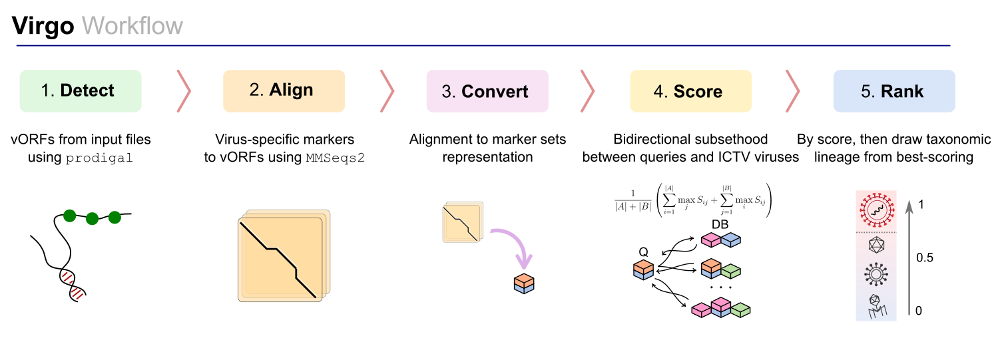

# Virgo

[](LICENSE)
[](VERSION)

### Overview
**Virgo** is a computer program for the classification of viral sequences. The taxonomic labels are taken from the ICTV to ensure a consistent and accurate naming of each predicted lineage. It is easily scalable and achieves an average F1 score above 0.9 even on highly fragmented genomes, making it ideal for the study of metagenomic sequencing data. Virgo is written in python and has minimal requirements, for best user experience and rapid analyses. 


---

## Table of Contents

- [Virgo](#virgo)
    - [Overview](#overview)
  - [Table of Contents](#table-of-contents)
  - [Features](#features)
  - [Installation](#installation)
    - [Usage](#usage)
      - [Input](#input)
      - [Output](#output)
      - [Data](#data)
    - [Example](#example)
    - [Building the Database](#building-the-database)
    - [Troubleshooting](#troubleshooting)

---

## Features

- **Innovative**: Virgo uses the _bidirectional subsethood_ of shared marker profiles between two sequences to score their similarity. This metric ranks a query against each ICTV virus, and the taxonomic lineage of the reference virus with the highest bidirectional subsethood score is assigned as the most probable virus family.
- **Broad-spectrum**: The markers are an extract of the virus-specific markers released with geNomad, and they represent a significant advancement in recent metagenomic research.
- **Thinking ahead**: Virgo is compatible with any version of the Virus Metadata Resource. This enables fair comparison to previous software, while providing a solution to ever growing and improving resource, the ICTV.

---

## Installation

To set up the environment for this project, you can use **conda** and the provided `environment.yaml` file, which includes all necessary dependencies.

1. First, ensure that you have [Conda](https://docs.conda.io/projects/conda/en/latest/user-guide/install/index.html) installed.
2. Clone the repository and navigate to the project directory:

   ```bash
   git clone https://github.com/christopher-riccardi/Virgo.git
   cd Virgo
   ```

3. Create and activate the environment using the `environment.yaml` file:

   ```bash
   cd environment
   conda env create -f environment.yaml
   conda activate virgo
   ```

The environment includes the following key dependencies:
- `pandas`
- `numpy`
- `mmseqs2`
- `prodigal-gv`

This will ensure that all necessary tools and libraries are installed and ready to use.

### Usage 
Virgo classifies the viral sequences in FASTA format present in a user-defined folder using information from a database. There are three essential, required arguments:

   ```bash
   python virgo.py [-h] -i INPUT -o OUTPUT -d DATA [-t NUM_THREADS] [--with_replacement] [--no_gc] [--version]
   ```

#### Input
INPUT is the folder with uncompressed sequence files with extensions .fa, .fasta, .fna or .ffa.  

#### Output
OUTPUT is the path to an output directory that will host the temporary files and the results table. 
The table `results.csv' will contain the classification results for the input viruses, condensing all the data in a single file for easier interpretation.  

#### Data
DATA is the database needed by Virgo to perform classification.  


> [!NOTE]
> **An up-to-date version is always found [here](https://figshare.com/ndownloader/files/49237189).**  

Optionally, you may build your own following the instructions listed [here](#building-the-database)  (slower)

Several steps are taken care of behind the scenes, and Virgo greatly benefits from multithreading. We recommend running Virgo using the ```-t``` flag, and strongly advise to read [our paper]() to understand the overall classification engine.

### Example  
You can test Virgo on the viruses distributed with this repository, under `test/input'. This testing set is composed of 7 sequences drawn from the database itself. To make things interesting, you can run Virgo using the ```--with_replacement``` flag. This will make Virgo skip _self_ entries and try to infer the taxonomic lineage based on incomplete information. For this set of data, you will still obtain a 100% accuracy at the family level prediction.
   ```bash
   python src/virgo.py -i tests/data/input/ -o output -d VMR_MSL39_v1/ -t 16 --with_replacement
   ```
Virgo outputs a table containing each query's file name, the taxonomic lineage, the G+C content difference between the query and the most similar entry, the bidirectional subsethood score (we'll call it _score_ from now on), the tie score and the absolute number of ties. The latter corresponds to the absolute number of other entries with the same score for that specific ICTV release.
The tie score, instead, reflects the diversity of families that are present in the tied pool. A tie score of 1 indicates that, regardless of the number of ties, only one family taxon was attributed -- a tie score of 0.5 indicates that _two_ families share the same score, and that the G+C content was used to guide the selection of the most probable database viruses from which to borrow the taxonomic lineage. 
We provide the table with the expected results of the above command at `tests/data/expected_results.csv'. To inspect this table using python, you can use the following commands:

```{bash}
>>> import pandas as pd
>>> vf = pd.read_csv('tests/data/expected_results.csv')
>>> vf
                     id          Realm         Kingdom            Phylum             Class             Order             Family  gc_delta  score  tie_score  n_ties
0  sort_12379_1_8_14452      Riboviria   Orthornavirae   Negarnaviricota   Insthoviricetes   Articulavirales   Orthomyxoviridae    0.0441  1.000      1.000       0
1  sort_12607_4_1_29274      Riboviria   Orthornavirae      Pisuviricota   Pisoniviricetes       Nidovirales      Coronaviridae    0.0067  0.923      1.000       2
2    sort_14239_1_1_996            NaN             NaN               NaN               NaN               NaN  Alphasatellitidae    0.0010  1.000      0.143      38
3    sort_5207_1_1_7961   Monodnaviria    Shotokuvirae     Cossaviricota   Papovaviricetes  Zurhausenvirales   Papillomaviridae    0.0883  1.000      1.000       2
4    sort_608_1_1_41268  Duplodnaviria  Heunggongvirae       Uroviricota    Caudoviricetes               NaN  Autographiviridae    0.0030  0.882      1.000       0
5    sort_6402_1_1_2778   Monodnaviria    Shotokuvirae  Cressdnaviricota  Repensiviricetes    Geplafuvirales      Geminiviridae    0.0015  1.000      1.000      18
6  sort_7279_1_10_17910      Riboviria   Orthornavirae  Duplornaviricota  Resentoviricetes        Reovirales     Sedoreoviridae    0.0175  1.000      1.000       4
```
Notice how most of the taxonomic lineage for the virus belonging to the _Alphasatellitidae_ family is missing (NaN values). This is expected, and consistent with the taxonomic classification ratified by the ICTV. Notice also how the virus attributed to the family _Autographiviridae_ does not have an order assigned. This is also consistent with the current restructuring that is happening for bacteriophages. Finally, we point out the tie score and number of ties (second to last and last column) that arent't always correlated.
.
### Building the Database  
The data folder required by Virgo through the command line option ```-d``` is a bundle of 9 files. 8/9 are the MMSeqs2 database files relative to the virus-specific markers, and these we redistribute under CC 4.0 by Antonio Camargo, via Zenodo. The 9th file is a pickle database file that contains the pre-calculated unordered collections of matched markers for a specific version of the ICTV. For example, the bundle **VMR_MSL39_v1/** will contain a file named `database.pkl' which is the data structure with taxonomic information relative to the ICTV-ratified taxa released in version #39 as well as the compressed sets representations of the virus-specific markers matched in all viruses for that specific ICTV release. 

Having these internals in mind, there are few steps to follow in order to generate the bundle:  

- Access a version of the VMR. If you're conducting a study where you need to go back in time you can use [ICTVdump](https://github.com/christopher-riccardi/ICTVdump) by providing the link to the [VMR spreadsheet](https://ictv.global/vmr). If you ran ICTVdump in the past you may already have the SQL file and the script would run even faster, otherwise it will be generated automatically. This step is fundamental, since it returns an SQL database with the GenBank sequences and a taxonomy table file. These files will be used in the third step.
- Download and unzip the [Virus-specific markers](https://zenodo.org/records/13686166/files/Virus_Specific_Markers.zip?download=1). This folder contains the 8/9 files mentioned earlier.
- Now run the script ```create_virgo_database.py``` by providing the following command line arguments:
  ```{bash}
  --sql SQL             SQL database created by ICTVdump
  --taxonomy_table TAXONOMY_TABLE
                        Taxonomy table created by ICTVdump
  --virus_markers VIRUS_MARKERS
                        Markers dataset folder
  -o OUTPUT, --output OUTPUT
                        Name of output directory that will contain Virgo database files
  -t NUM_THREADS, --num_threads NUM_THREADS
                        Number of threads to use for multiprocessing
  ```
The final result is an output directory with the freshly bundled database, and you will be ready to use Virgo with a specific version of the VMR.  

### Troubleshooting  
If you found a bug or mistake in this project, we would like to know about it. Before you send us the bug report though, please check the following:
  1. Are you using the latest version? The bug you found may already have been fixed.
  2. Check that your input is in the correct format and you have selected the correct options.
  3. Please reduce your input to the smallest possible size that still produces the bug; we will need your input data to reproduce the problem, and the smaller you can make it, the easier it will be.

<details>
<summary>Contact information</summary>
For inquiries, contact us at fsun@usc.edu
</details>
